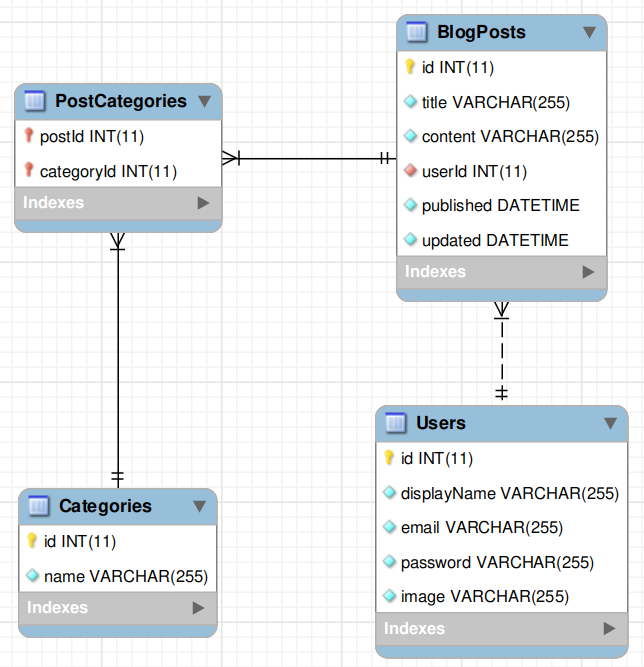

# Projeto Blog API

Neste projeto, colocamos em prática, pela primeira vez, a utilização do Sequelize para criar o Banco de Dados, as tabelas e também para realizar as consultas ao Banco de dados da camada Model.

Vale ressaltar que mantido o estilo arquitetural MSC e o REST API.

Todo o processo de desenvolvimento foi feito com NodeJS com o auxílio da biblioteca Express.

---

# Habilidades

- Desenvolver uma API CRUD com o NodeJs utilizando o Express;

- Desenvolver queries e criar tabelas do Banco de Dados através da ORM (Object-Relational Mapper) Sequelize;

- Utilizar o JWB (JSON Web Token) para validar e autenticar um usuário;

- Criar MiddleWares de validação de dados para as requisições;

- Utilizar da arquitetura MSC (Model, Service, Controller) e REST API;

- Desenvolver as relações 1:1, 1:N e N:N através do Sequelize.

---

## Requisitos

Ao todo foram 18 requisitos, sendo um 3 deles bônus:
  
#### 1. Crie migrations para as entidades User, Categories, BlogPosts, PostCategories;
#### 2. Crie o modelo 'User' em 'src/database/models/user.js' com as propriedades corretas;
#### 3. Sua aplicação deve ter o endpoint POST `/login`;
#### 4. Sua aplicação deve ter o endpoint POST `/user`;
#### 5. Sua aplicação deve ter o endpoint GET `/user`;
#### 6. Sua aplicação deve ter o endpoint GET `/user/:id`;
#### 7. Crie o modelo 'Category' em 'src/database/models/category.js' com as propriedades corretas;
#### 8. Sua aplicação deve ter o endpoint POST `/categories`;
#### 9. Sua aplicação deve ter o endpoint GET `/categories`;
#### 10. Crie o modelo 'BlogPost' em 'src/database/models/blogPost.js' com as propriedades e associações corretas;
#### 11. Crie o modelo 'PostCategory' em 'src/database/models/postCategory.js' com as propriedades e associações corretas;
#### 12. Sua aplicação deve ter o endpoint POST `/post`;
#### 13. Sua aplicação deve ter o endpoint GET `/post`;
#### 14. Sua aplicação deve ter o endpoint GET `/post/:id`;
#### 15. Sua aplicação deve ter o endpoint PUT `/post/:id`.

### Bônus

#### 16. Sua aplicação deve ter o endpoint DELETE `/post/:id`;
#### 17. Sua aplicação deve ter o endpoint DELETE `/user/me`;
#### 18. Sua aplicação deve ter o endpoint GET `/post/search?q=:searchTerm`.